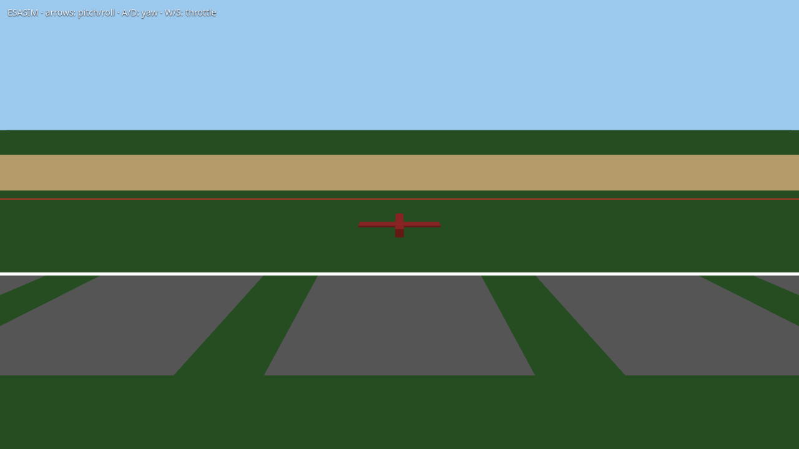

# ESASIM

**Multiplayer browser sim of ESA (Electric Simple Aircombat)**, the Polish R/C air-combat class: small foam WWII fighters (70-86 cm, max 450 g), a 10 m paper streamer on every tail, up to seven pilots in one sky. Field, planes and scoring follow the [ESA regulations](http://www.aircombat.pl/ACES/forum/viewtopic.php?t=21).

> **This game is bait.** It exists to get you flying ESA air combat in the real world. If you like it, the in-game intro points to the real thing: rules, plans, planes, videos, and teams. (Shops, videos and teams are still being researched: Poland first, then worldwide.)


## Status

Early skeleton: not a game yet.

- [x] ESA rules downloaded to [`papers/poland/`](papers/poland/) and extracted with citations: [`docs/rules.md`](docs/rules.md)
- [x] Contest site built to scale from ESA §2 (safety line, pilot line, readiness line, 50 x 20 m landing field, 7 start boxes)
- [x] Stack: Vite + Three.js + Colyseus; two players see each other's placeholder planes
- [x] Flight model v0, no stabilisation, hand launch (§4.4), generic 400 g foam fighter; needs tuning
- [x] RadioMaster support with calibration panel (key R), ported from the drone sim; keyboard fallback
- [ ] Streamer and cut detection (§3.7, §4.11)
- [ ] Fight phases, scoring, safety-line penalties (§4, §6)
- [ ] Workshop: build and modify planes within the class limits (§3)



The site seen from above, built from ESA §2: red = safety line, white = pilot line (3 m behind), green = readiness line, yellow = audience zone, tan = 50 x 20 m landing field, grey = start boxes. The rules do not give a flight-zone size, so that one is a design choice.


## Run it

```bash
npm install
npm run server   # Colyseus on :2567
npm run dev      # client on :5173
```

Open http://localhost:5173. Space = hand launch. With a radio (USB joystick mode): press R to map and calibrate it. Keyboard: arrows pitch/roll, A/D yaw, W/S throttle. Without the server it runs offline. `node test/flight.test.js` checks the flight model.

## Docs

- [`docs/rules.md`](docs/rules.md): the ESA rules, extracted with citations
- [`docs/rules-aces.md`](docs/rules-aces.md): the ACES fallback rules
- [`docs/drone-sim-audit.md`](docs/drone-sim-audit.md): what was reused from the earlier drone sim
- [`docs/fly-for-real.md`](docs/fly-for-real.md): verified Polish shops, guides, teams and contests (feeds the in-game intro)
- [`docs/models.md`](docs/models.md): what plane models are needed

## Rules and decisions

Every game rule in the code cites its § of the [ESA 2024 regulations](papers/poland/Regulamin_Aircombat_ESA_2024.pdf) (see [`shared/rules.js`](shared/rules.js)); ESA falls back to the international ACES rules for anything it does not cover (extract: [`docs/rules-aces.md`](docs/rules-aces.md)). The official 2026 announcement says the regulation is unchanged from 2024/2025. Where the rules are silent, the choice is marked DESIGN. The PDFs in `papers/` govern over any summary in this repo. Plans and changes are logged in [`CLAUDE.md`](CLAUDE.md).

## Credits

ESA and ACES rule documents belong to their authors (ACES Polska, aircombat.eu), included for reference. Built by [asdfgh0318](https://github.com/asdfgh0318), vibecoded with Claude Code. Earlier sim: [fpv_simulator](https://github.com/asdfgh0318/fpv_simulator).
