# ESASIM

**Multiplayer browser sim of ESA (Electric Simple Aircombat)**, the Polish R/C air-combat class: small foam WWII fighters (70-86 cm, max 450 g), a 10 m paper streamer on every tail, up to seven pilots in one sky. Field, planes and scoring follow the [ESA regulations](http://www.aircombat.pl/ACES/forum/viewtopic.php?t=21) (unchanged for 2026).

> **This game is bait.** It exists to get you flying ESA air combat in the real world. If you like it, the in-game intro points to the real thing: rules, kits, build guides, squadrons and contests (Poland first, worldwide next).

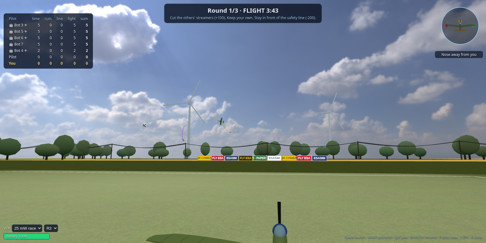

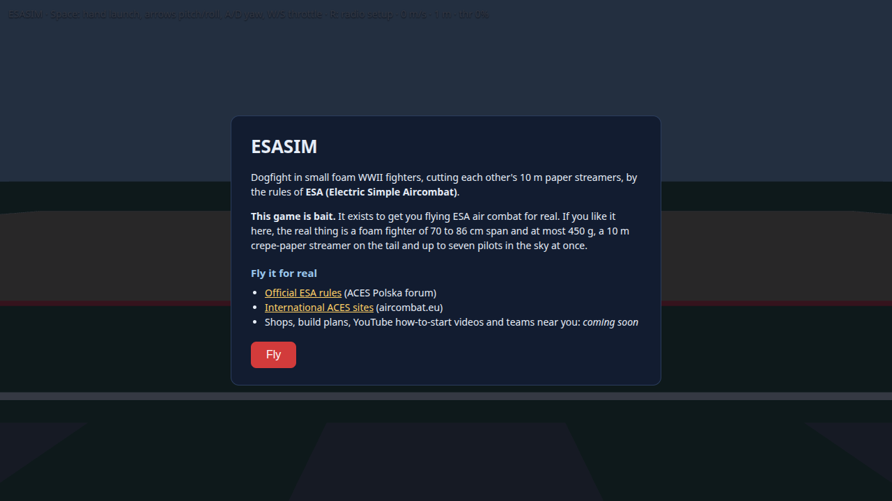

## What works now

- **A full ESA contest**: a waiting room, then rounds and a final (3 rounds + final per §4.1, points add up, ties by the final then the best single fight, §4.16). Each fight: preparation (test flights), readiness, a 5-minute flight, landing, results. Up to 7 pilots, humans and bots.
- **PicaSim-derived flight physics**: each plane is a rigid body flown by blade-element aerofoils (real stall curves, drag buckets, prop wash, ground effect) and a blade-element propeller with RPM dynamics, ported from [PicaSim](https://github.com/Rowlhouse/PicaSim) with ESA-specific plane definitions ([`docs/physics.md`](docs/physics.md)).
- **Advanced physics editor**: about 175 PicaSim-style parameters of your plane (wing CLPerDegree, flap fractions, control throws, propeller radius and torque, masses, positions, size/mass/drag/engine scales ...), searchable, with import and export. The weighed mass and the measured span still count for legality.
- **Streamers and cuts**: the 10 m streamer follows the tail's trace with turbulence wobble. A cut happens when the prop disc or the wing leading edge sweeps through an enemy streamer (swept tests, so fast passes don't tunnel).
- **ESA scoring** (§6, WWII): +1 per 3 s of flight (100 for the full time), +100 per cut (one attack = one cut), +50 for keeping your streamer, +20 for landing in the 50 x 20 m field after the end signal, −200 for crossing the safety line (second crossing: disqualified), −50 for avoiding combat.
- **Workshop**: tune your plane (type, span, battery, prop, ballast) inside the ESA limits (span 700-860 mm, 200-450 g, 15 Wh). The battery drains with throttle, so a bigger one is heavier but lasts. An illegal plane still flies but scores 0 for the round (§6).
- **Four modelled planes** (Spitfire, Hurricane, FW 190, Yak-3), built in OpenSCAD to ESA kit proportions, plus the **Electric Kato** flying wing from PicaSim (its aerodynamic numbers; our own model). The Kato is a tail-less flying wing (elevator and ailerons share the same elevons), flown with the sticks; it is ESA-legal at the default 800 mm (about 285 g) but it is not a WWII warbird. Bots fly it too (they cruise slower so its wide turns fit the flight zone).
- **Pursuit bots**, so you can test alone: add up to six, at three skill levels (easy, club, ace); they break away when someone sits on their tail. Gusty air is shared by all planes (the same wind on the server and in your browser).
- **Hand launch** like real WWII ESA, from your start box. **Pilot camera** standing at your start box and following the plane (default), or **analog-style FPV** (V): scanlines, snow and tearing grow with distance from you, ending in signal lost.
- **Textured sky** (procedural clouds and sun) and a **beginner orientation widget** in the top-right corner: your plane as you see it from the start box, with a yellow nose arrow, an orange sphere (left) and a blue cube (right) on the wing tips and a plain-language label ("Nose toward you · banked left").
- **Analog FPV and video interference**: every plane carries a video transmitter (power 25, 50 or 100 mW, the maximum in this game, channel R1-R8). Range grows with power. Another pilot's transmitter near your start box, especially a 100 mW one next to your 25 mW, only now and then draws a short thin horizontal glitch line in your feed (at 100 mW at most, that is all a pass-by does; your own range still decides how far you can fly). Switch power and channel live (model in your hand). This is a sim effect, ESA has no VTX rules.
- **Replay**: after a fight, watch it back (scoreboard and events included) or save it as JSON, useful as evidence for protests (§4.19).
- **RadioMaster support** (any USB joystick-mode radio) with mapping and calibration (key R), ported from the author's earlier drone sim. Keyboard works too.
- **Fair online play**: the server judges cuts with **lag compensation** (it rewinds the victim's streamer by your measured round trip, capped at 250 ms, see [`docs/netcode.md`](docs/netcode.md)), your own streamer is drawn locally, other planes are shown 100 ms in the past so they move smoothly, a dropped pilot can **reconnect** to the same box, and the server rejects teleports and impossible reports.
- **Private rooms**, a host who starts the fight, **End match** / **Leave** buttons, optional **voice chat**, and contest rooms (`&strict=1`) without the physics editor.
- **Polish and English UI** (`?lang=pl|en`), a first-flight guide, sound (whistle, cut, motor), colour-blind-friendly wing markers, and a results screen that links to real ESA resources.
- The flight model, streamer, cut detection, scoring, series, workshop, bots, rooms, lag compensation and the server are headless and covered by tests (`npm test`, 173 checks).

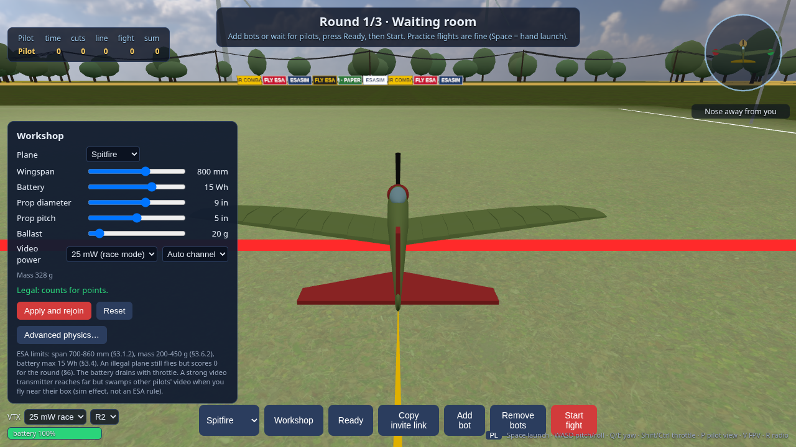
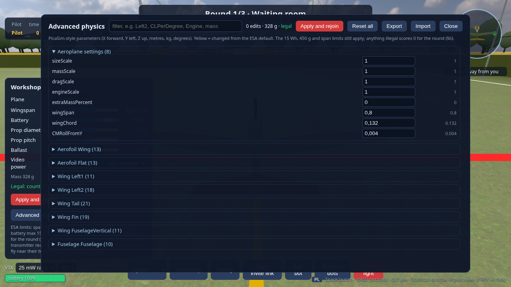
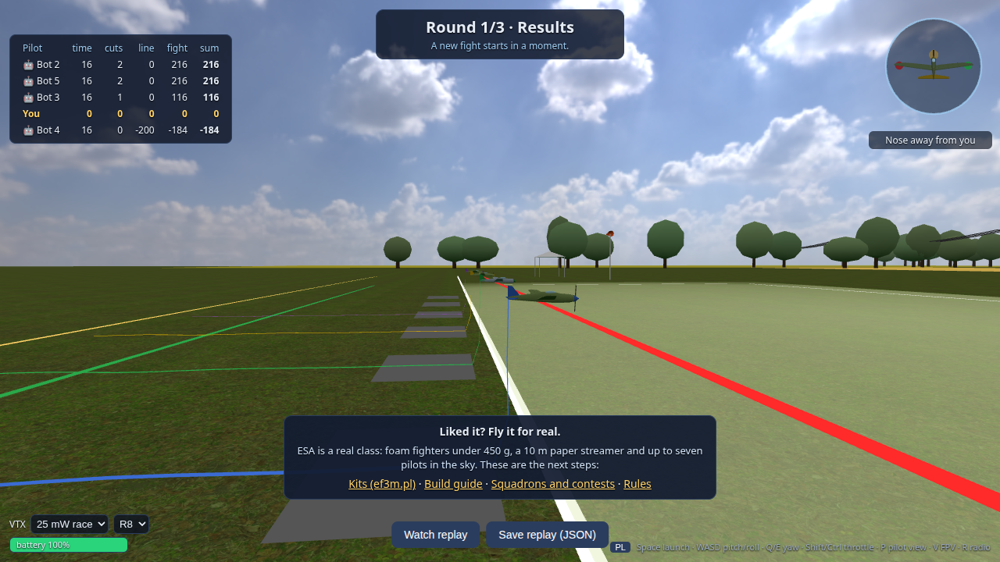
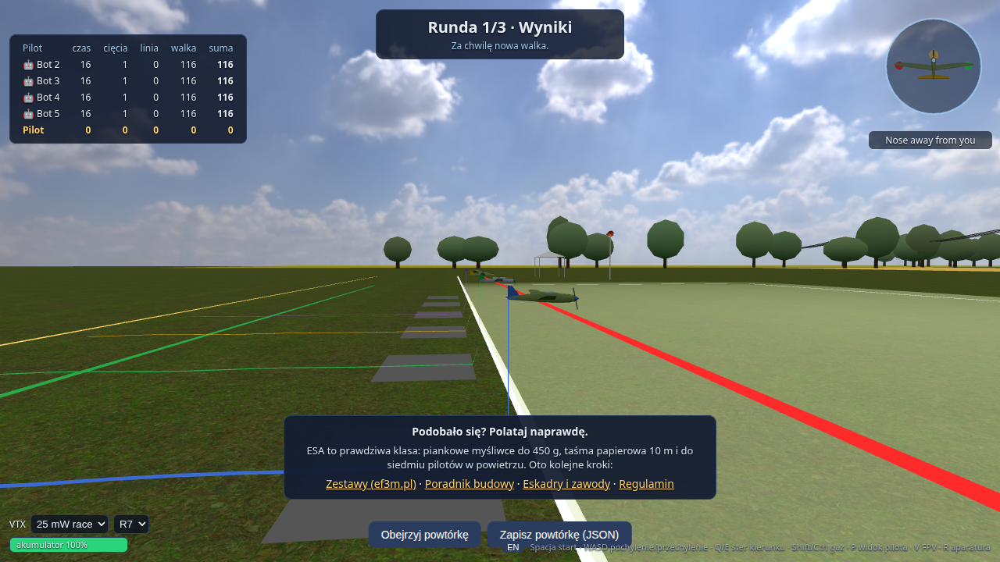
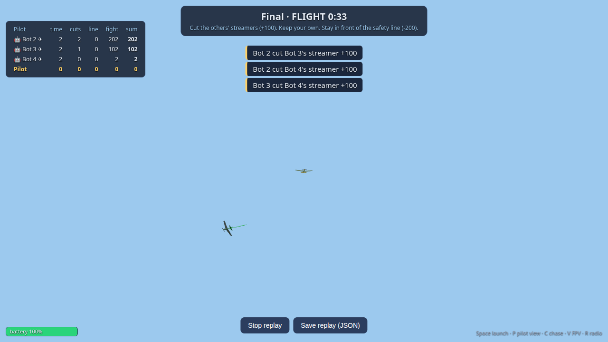
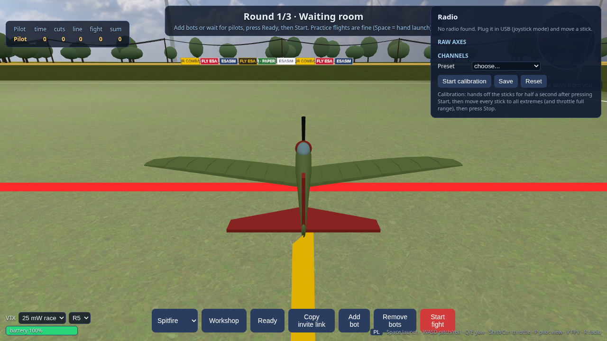
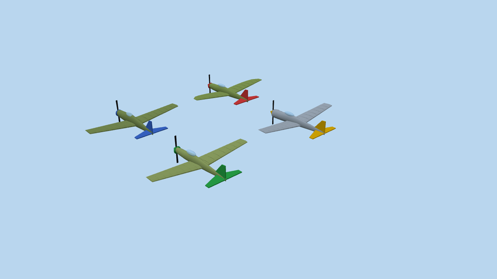
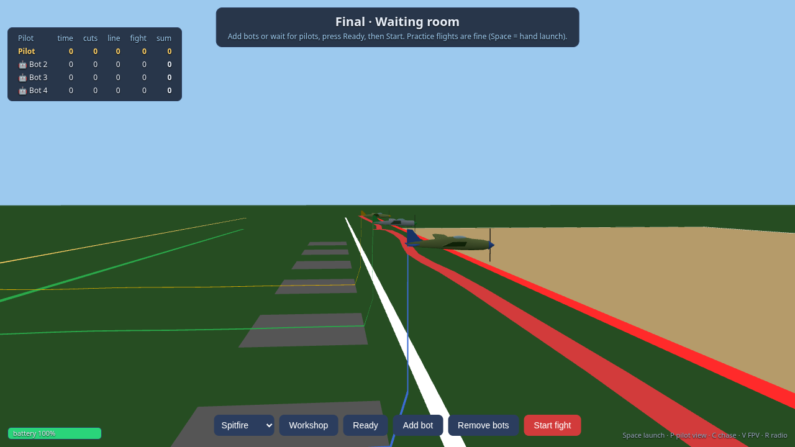
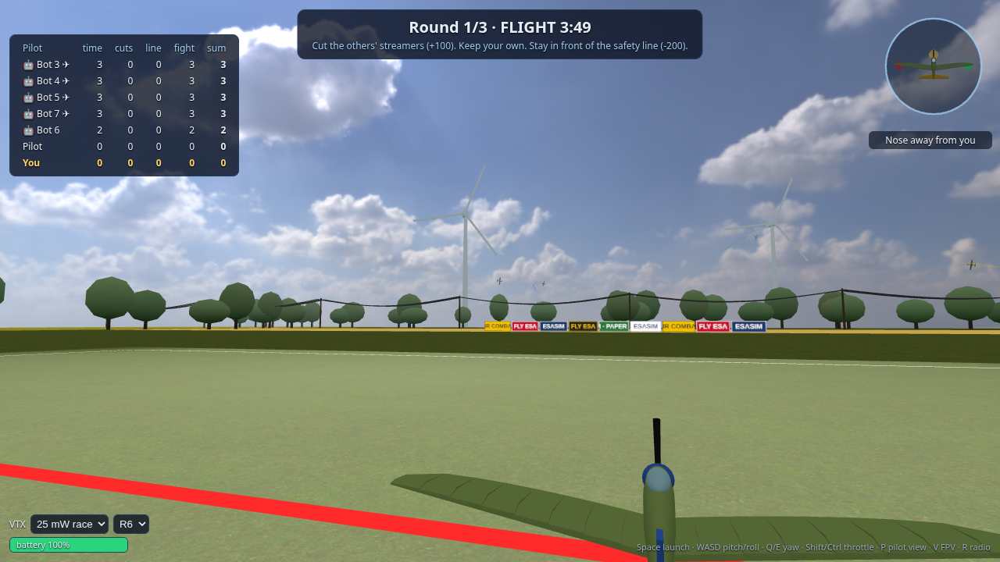
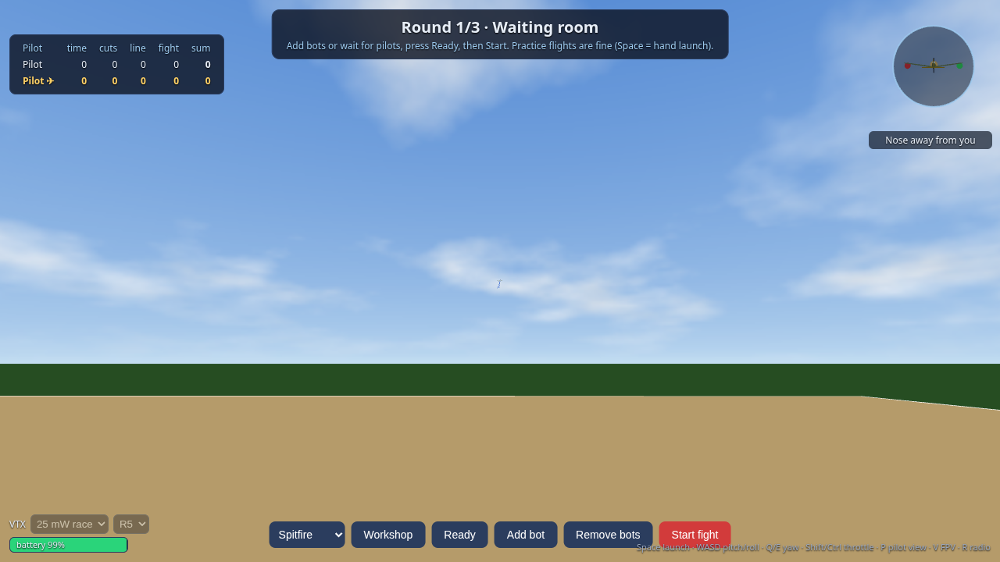
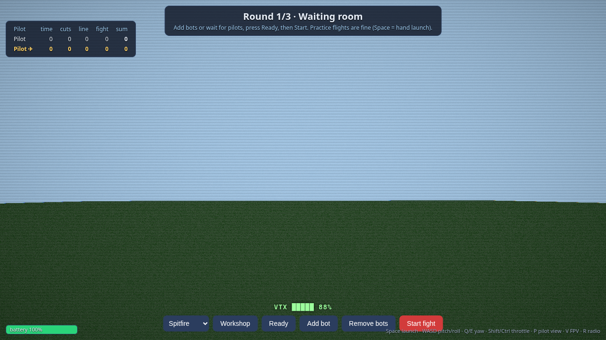
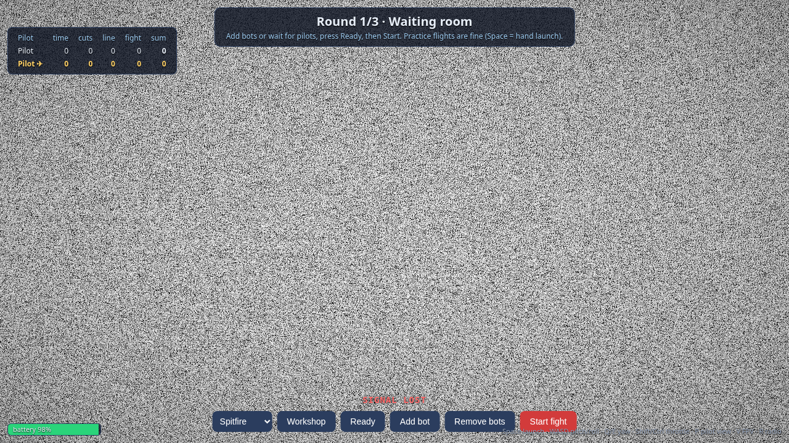
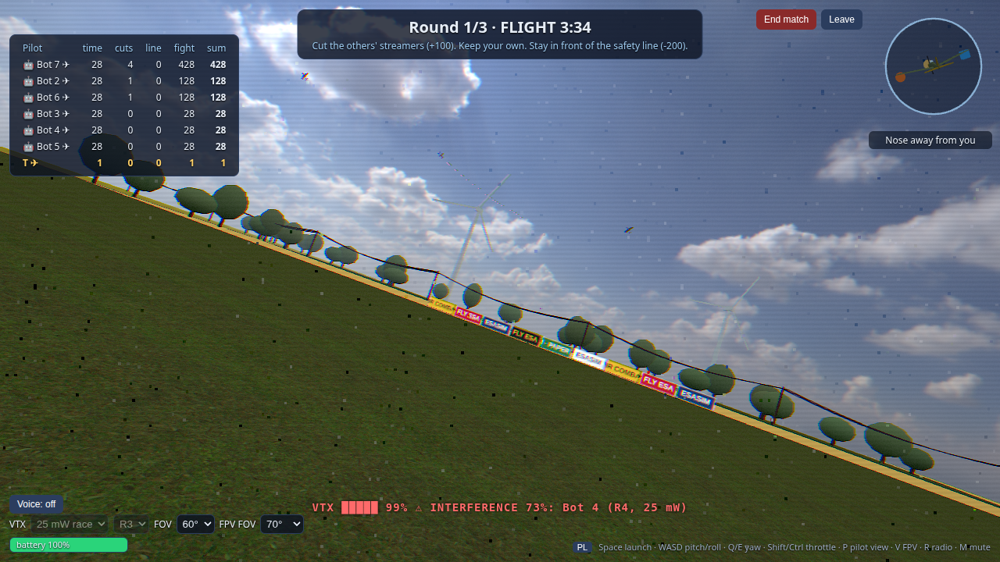

The contest site is built from ESA §2: red = safety line, white = pilot line (3 m behind), green = readiness line, yellow = audience zone (behind the pilots), a slightly lighter mown patch with white tape = 50 x 20 m landing field, grey = 7 start boxes. Around it: a tree line, wheat fields, a powerline, wind turbines, banners, tents and flags (all VISUAL, generic names, no real brands), after photos of real ESA/ACES pitches (plain mown grass and tape lines). The rules do not give a flight-zone size, so that one is a design choice.

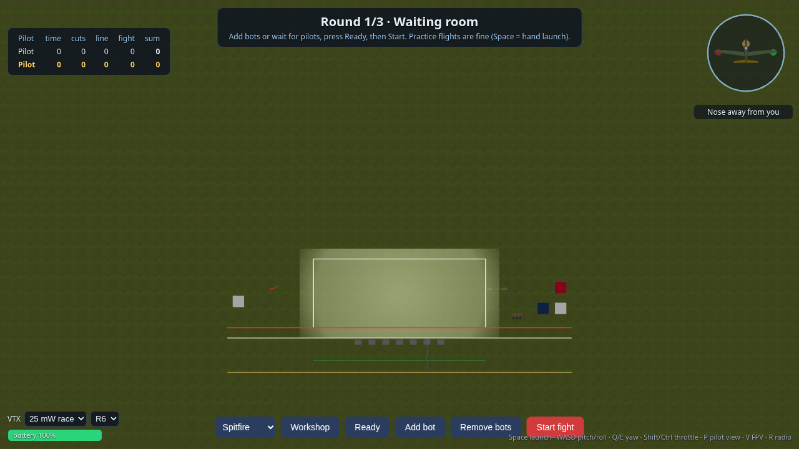

## Play it

```bash
npm install
npm start        # game server (:2567) and client (http://localhost:5173) together
```

(`npm run server` and `npm run dev` start them separately.)

1. Open http://localhost:5173. Press **Add bot** a few times, **Ready**, **Start fight**. **Workshop** tunes your plane.
2. During preparation and flight press **Space** to throw your plane, then fly. Keyboard (same layout as the drone sim): **W/S pitch** (W = nose down), **A/D roll**, **Q/E yaw**, **Shift/Ctrl throttle**; arrows also pitch/roll. With a radio: plug it in (joystick mode), press **R** to map and calibrate.
3. Cameras: **P** pilot view (default), **V** analog FPV. The video transmitter (power, channel) is switched with the selectors bottom left, with the model in your hand; everybody is limited to 100 mW in this game.
4. Others can join the same room from other browsers (`?server=<host>` if the server is on another machine). Without a server the page runs as offline practice.

### Play with a friend

- **Same network (one port):** run `npm run play` (builds the client, then the game server serves it). Find your address (`hostname -I`) and your friend opens `http://<your-address>:2567`. Both of you land in the same room (up to 7 pilots, bots included). Open port 2567 in your firewall if needed. Tested: the page loads and connects through `localhost` and through the LAN address.
- **Developing:** `npm start` runs the game server (:2567) and the Vite dev client (:5173) together; the dev client accepts any host name.
- **Over the internet (not tested yet):** with `npm run play` only one port is needed, so one tunnel should be enough, for example `cloudflared tunnel --url http://localhost:2567`; your friend opens the https address it prints. I have not run a tunnel yet.
- **Private rooms:** the lobby button "Private room" opens `?room=CODE` and then copies the invite link; the longest-present human is the host and is the only one who can start the fight or add bots. A pilot whose connection drops keeps the box and the contest score for 30 s and reconnects by itself.
- **Ending a match:** the host has an "End match" button (back to the waiting room, the running fight is not scored) and every player has "Leave" (offline practice).
- **Contest room:** add `&strict=1` to the room link (before anyone joins): the advanced physics editor is switched off, so everybody flies the ESA-checked workshop builds only.
- **Two pilots on one computer, each with a controller:** open a second window (a separate browser profile keeps its own settings, for example `brave --user-data-dir=$HOME/brave-pawel --no-first-run --new-window "http://localhost:5173/?nointro&name=Pawel&pad=1"`) and give every window its own gamepad with `&pad=N` (the gamepad number shown in the radio panel, key **R**, or a part of its name). A `&pad` window only reads that gamepad and keeps its own calibration; `&preset=gamepad` or `&preset=radiomaster` sets a mapping the first time. Both windows join the same room (the default room, or the same `?room=CODE`).
- Pilot names: add `&name=Alice`. The friend flies with the keyboard (WASD, Q/E, Shift/Ctrl, Space) or a USB radio (press R).

Short phases for testing: `ESASIM_PREP=5 ESASIM_READY=2 ESASIM_FLIGHT=60 ESASIM_ROUNDS=1 npm run server`.

## Voice chat

In a private room (`?room=CODE`) there is a "Voice: off" button. Click it once to allow the microphone: you are then in push-to-talk mode (hold **T**); click again for an open microphone, once more to switch voice off. Audio goes directly between the pilots (WebRTC); the game server only relays the connection handshake. Nobody is heard or connected until they switch voice on, and the public shared room has no voice. A 🔊 marks who is speaking in the score table.

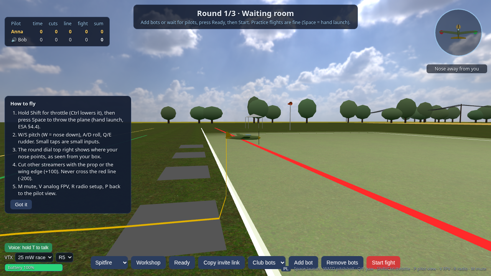

- The browser only allows the microphone on `https://` pages or `localhost`. Over plain `http://<LAN address>` it is blocked: use a tunnel with https (see above), or in Chrome open `chrome://flags/#unsafely-treat-insecure-origin-as-secure` and add your `http://<address>:2567`.
- On the same network it works without any extra service. Across the internet through home routers it may need a STUN server: add `&stun=1` to the room link (this uses a public Google STUN server, which sees your address). A TURN relay is not included, so some networks will not connect.
- Tested with two headless browsers and fake microphones (they connect and the speaking marker works); not tested with real people over the internet.

## Controls and language

The field of view is a setting, separately for the pilot view (40 to 90 degrees, default 60) and for the FPV camera (60 to 120 degrees, default 70), next to the video transmitter selectors. Keyboard sticks ramp up (about 0.3 s to full) and have expo, so a tap is a small input; press R for the radio panel, which has presets for a RadioMaster (AETR) and a gamepad (mode 2) plus calibration. The UI is Polish or English (`?lang=pl|en`, or the PL/EN button; Polish browsers start in Polish; the Polish text is a first draft). After every fight the results screen links to real ESA resources.

Wings carry aerobatic stripes in each pilot's colour (white between the stripes on top, black underneath), so planes stay visible against sky and grass and top and bottom are easy to tell apart. Purely visual (`client/planeModel.js`).

## Models

`models/scad/esa_plane.scad` (the four warbirds) and `models/scad/kato.scad` (the flying wing) are the sources (need `openscad`); `tools/build-models.sh` rebuilds the STLs in `public/models/`; `viewer.html?plane=all` previews them.

## Tests

`npm test` (173 checks) runs the flight model and the Kato, streamer and cut detection, fight scoring (one check per §6 line), the workshop limits and battery, the rule fixes from the audit, the contest series, a headless 5-minute bot fight, lag-compensated cuts, and server tests with real WebSocket clients (fight, rooms, reconnect, host-only controls). GitHub Actions runs them on every push.

## Honest status

- The physics engine is PicaSim's; the **ESA plane numbers on top of it are my estimates** (marked in `shared/picasim/esaDef.js`) and need real stick time. The default planes are deliberately foamy-aerobat-like (+20 % mass, more thrust, bigger throws). The Kato is tuned to be flyable (stronger elevons, mild camber), not a faithful PicaSim copy; see [`docs/physics.md`](docs/physics.md).
- Each browser still flies its own plane and the server judges. The server checks reports for plausibility and compensates lag, but a modified client could still cheat on its own flight ([`docs/netcode.md`](docs/netcode.md)). Lag compensation, voice chat and the tunnel instructions have not been tested over a real internet connection.
- Not done yet: stuck streamers (§4.11), the 'pilot in zone' procedure (§4.6), the wing/tail tolerance at the safety line, the WWI class, bots flying closer to the pilots, better 3D models (the OpenSCAD ones are stylised). See the [issues](https://github.com/asdfgh0318/esasim/issues) and the audit in [`docs/audit-and-roadmap.md`](docs/audit-and-roadmap.md).
- The RadioMaster panel has not been tested with real hardware. The Polish text is a first draft. The workshop's mass and prop formulas are my estimates (listed in `shared/workshop.js`).

## Docs

- [`docs/rules.md`](docs/rules.md): the ESA rules, extracted with citations and mapped to the code
- [`docs/physics.md`](docs/physics.md): the PicaSim-derived flight physics, the ESA plane definitions, the foamy defaults, throws, the Electric Kato, the parameter editor
- [`docs/netcode.md`](docs/netcode.md): how cuts are judged online (lag compensation), what the server checks, what a cheater can still do
- [`docs/audit-and-roadmap.md`](docs/audit-and-roadmap.md): the audit of the project and the development paths, with a status note
- [`docs/venues.md`](docs/venues.md): the real venues used as visual reference
- [`docs/rules-aces.md`](docs/rules-aces.md): the ACES fallback rules
- [`docs/fly-for-real.md`](docs/fly-for-real.md): verified Polish shops, guides, teams and contests (feeds the in-game intro)
- [`docs/drone-sim-audit.md`](docs/drone-sim-audit.md): what was reused from the earlier drone sim
- [`docs/models.md`](docs/models.md): the OpenSCAD planes, dimensions, licences and what was checked
- [`CLAUDE.md`](CLAUDE.md): plans, decisions and changelog

Every game rule in the code cites its § of the [ESA 2024 regulations](papers/poland/Regulamin_Aircombat_ESA_2024.pdf) (see [`shared/rules.js`](shared/rules.js)); ESA falls back to the international ACES rules for anything it does not cover. The PDFs in `papers/` govern over any summary in this repo.

## Licence

ESASIM is source-available and free for hobbyists: [PolyForm Noncommercial 1.0.0](LICENSE) (use, study, change and share for any noncommercial purpose). That licence is also what lets it build on PicaSim's physics; see [`NOTICE`](NOTICE).

## Credits

ESA and ACES rule documents belong to their authors (ACES Polska, aircombat.eu), included for reference. Flight physics derived from [PicaSim](https://github.com/Rowlhouse/PicaSim) by Danny Chapman. The Electric Kato's parameters come from PicaSim's data files; the plane is Kevin Bagwell's design (RCGroups); the 3D mesh is our own. Sky and grass textures: [Poly Haven](https://polyhaven.com/license), CC0 (Greg Zaal, Jarod Guest, Charlotte Baglioni). Built by [asdfgh0318](https://github.com/asdfgh0318), vibecoded with Claude Code. Earlier sim: [fpv_simulator](https://github.com/asdfgh0318/fpv_simulator).
