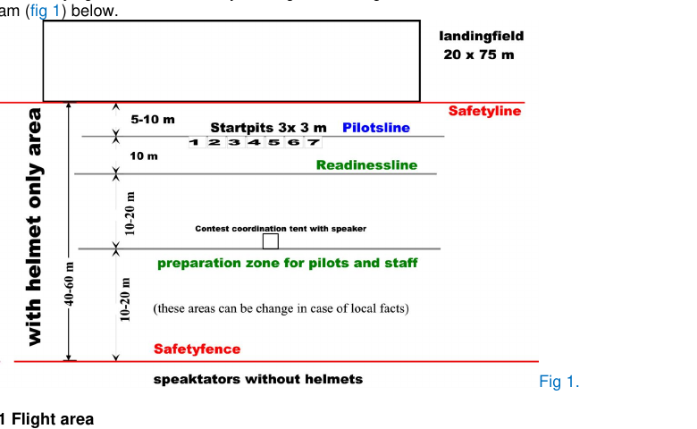

# ESASIM

**Multiplayer browser sim of ACES R/C Air Combat**: 1:12 WWII warbirds, a 12 m streamer on every tail, up to seven pilots in one sky. Field, planes and scoring follow the official [ACES rules](http://aircombat.eu/rules.htm).

> **This game is bait.** It exists to get you flying ACES in the real world. If you like it, the in-game intro points to the real thing: rules, plans, planes, videos, and teams. (Shops, videos and teams are still being researched.)


## Status

Early skeleton: not a game yet.

- [x] Rules downloaded to [`papers/`](papers/) and extracted with citations: [`docs/rules.md`](docs/rules.md)
- [x] Contest site built to scale from Fig. 1 of the rules (landing field 20 x 75 m, safety line, 7 start pits, readiness line)
- [x] Stack: Vite + Three.js + Colyseus; two players see each other's placeholder planes
- [x] Flight model v0, no stabilisation (§3.9), first plane FW-190D from a real ACES plan; needs tuning
- [x] RadioMaster support with calibration panel (key R), ported from the drone sim; keyboard fallback
- [ ] Streamer and cut detection (§3.6, §4.11)
- [ ] Fight phases, scoring, safety-line penalties (§4, §6)
- [ ] Workshop: build and modify planes within the class limits (§3)


The site is drawn from the rules' Fig. 1 (below). The rules do not give a flight-area size, so that one is a design choice.



*Fig. 1: ACES WWII Rules 2023, p. 1 (source: aircombat.eu).*

## Run it

```bash
npm install
npm run server   # Colyseus on :2567
npm run dev      # client on :5173
```

Open http://localhost:5173. With a radio (USB joystick mode): press R to map and calibrate it. Keyboard: arrows pitch/roll, A/D yaw, W/S throttle. Without the server it runs offline. `node test/flight.test.js` checks the flight model.

## Docs

- [`docs/rules.md`](docs/rules.md): the ACES rules, extracted with citations
- [`docs/drone-sim-audit.md`](docs/drone-sim-audit.md): what was reused from the earlier drone sim
- [`docs/models.md`](docs/models.md): what plane models are needed

## Rules and decisions

Every game rule in the code cites its § of the [2023 WWII rules](papers/2023_ACES_int_WWII%20Rules.pdf) (see [`shared/rules.js`](shared/rules.js)). Where the rules are silent, the choice is marked DESIGN. The PDFs in `papers/` govern over any summary in this repo. Plans and changes are logged in [`CLAUDE.md`](CLAUDE.md).

## Credits

Rules and Fig. 1 © ACES (aircombat.eu), included for reference. Built by [asdfgh0318](https://github.com/asdfgh0318), vibecoded with Claude Code. Earlier sim: [fpv_simulator](https://github.com/asdfgh0318/fpv_simulator).
