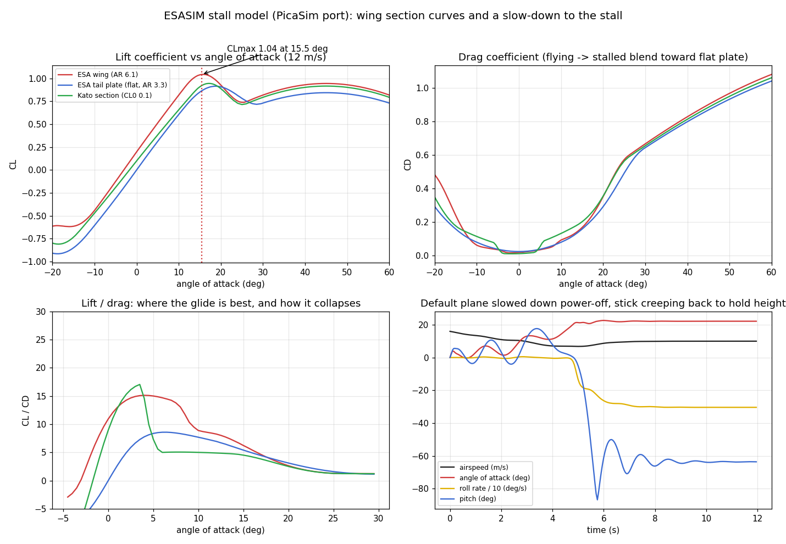

# The stall model (PicaSim port), and what it does

Chart: `docs/img/stall-model.png`, made from the real code (`shared/picasim/aerofoil.js`) at 12 m/s, plus a slow-down of the default plane.

## How a wing panel is modelled
Every wing and tail panel is its own aerofoil element with its own angle of attack. A section is described by a few numbers (`shared/picasim/esaDef.js`, editable in the advanced physics panel): `CL0`, `CLPerDeg` (0.085 per degree for the ESA wing), `positiveAttachedAngle` (9 deg), `positiveStallRange` (11 deg), the negative equivalents, `CDFlying`, `CDStalled`, the drag bucket (`dragBucketFactor`, lower and upper angle) and `refRe`, `CDPower` for the Reynolds scaling.

1. Up to the attached angle, lift grows linearly: CL = CL0 + CLPerDeg x angle. Drag is the low "flying" drag, plus induced drag CL^2 / (pi x AR x efficiency), plus a drag-bucket term that rises smoothly outside the bucket.
2. Over the next `stallRange` degrees a "flying" factor falls from 1 to 0 along half a cosine. Lift blends from the linear curve to flat-plate lift (1.1 sin 2a, reduced for low aspect ratio) and drag blends to stalled drag (about 2 - 0.82 (1 - e^(-17/AR)) times |sin a|).
3. A finite wing is handled by scaling the slope and stretching the angle with the aspect ratio (low-aspect panels stall later and softer).
4. Reynolds number scales only the drag (`(Re / refRe)^CDPower`), not the peak lift.
5. Ground effect raises the effective aspect ratio near the ground; prop wash and wing wash change the airspeed over the tail and the panels behind them, so power-on stalls later; control deflection adds lift, moment, camber and drag.

## What the chart shows (default ESA wing, AR 6.1)
- Lift peaks at CL about 1.04 at 15.5 degrees, falls to about 0.74 at 26 degrees and rises again toward a second, flat-plate hump (about 0.95 near 45 degrees). So the stall is wide and soft, with no sudden cliff.
- Drag is about 0.02 up to 6 degrees, 0.1 at 10, 0.2 at 16 and 0.55 at 25. Best lift/drag is about 15 near 4 degrees and falls below 5 past 17 degrees.
- The Kato section has a drag bucket that ends at 3 degrees, which gives the kink in its lift/drag curve around 3-6 degrees.
- Slowing the default plane down power-off while the stick creeps back to hold height: it flies to about 7 m/s and 17-21 degrees, then the nose drops (to about -60 degrees) and it settles into a sustained roll of about -300 deg/s at about 22 degrees angle of attack, which is a spin. It does not recover by itself while the stick stays back.

## What is not modelled
No hysteresis (the stall and the recovery happen at the same angle), no dynamic stall, no buffet or stall warning, no tip stall or wing washout (the two panels per side can stall differently only because of their own chord, flap deflection and airflow), no Reynolds effect on peak lift. Stall speed (about 7 m/s for the 394 g default at 12-13 degrees of margin) is therefore a result of the numbers above, not a measurement of a real foam plane.

Regenerate the chart with the script in the git history of this file (the data comes straight from `AerofoilDefinition.flightData`).
